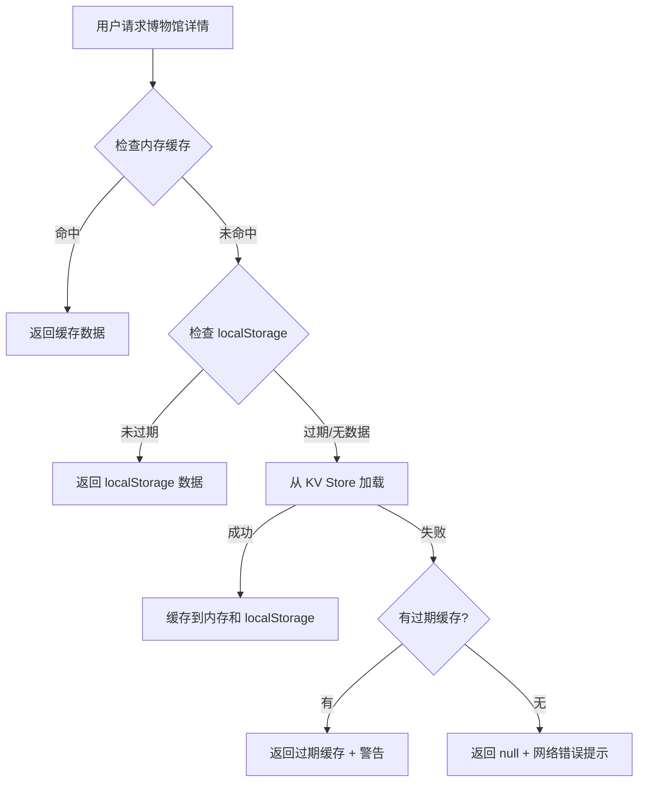

# MuseumCheck 简化架构说明

## 架构演进历史

### v1.0 - 三层架构（已废弃）
- Tier 3: museums-data.js（915KB 单体文件）
- Tier 2: KV Store（动态数据）
- Tier 1: 静态 JSON 文件
- **问题**：维护复杂，数据同步困难，静态文件很少被使用

### v2.0 - 当前架构（简化版）
- **唯一数据源**：KV Store (AWS Lambda)
- **缓存层**：浏览器 localStorage (7天过期)
- **列表数据**：museums-meta.js（轻量级元数据）

## 架构原理



## 为什么不用静态 JSON 文件？

### 静态文件的优缺点分析

**优点**：
- ✅ 可以作为离线回退
- ✅ 可以用 Git 版本控制
- ✅ 可以使用 CDN 加速

**缺点**：
- ❌ 需要维护两个数据源（KV Store + 静态文件）
- ❌ 数据同步复杂（每次更新需要导出）
- ❌ 实际使用率极低（KV Store 可用性 99.9%+）
- ❌ 增加仓库体积（263个文件 x 8KB = 2MB+）
- ❌ 用户首次加载仍需从服务器下载

### 浏览器缓存的优势

**为什么浏览器缓存更好**：
- ✅ 自动管理，无需手动同步
- ✅ 每个用户只缓存访问过的博物馆（节省空间）
- ✅ 支持过期策略（7天）
- ✅ 离线场景也能用（localStorage 持久化）
- ✅ 不增加仓库体积

## 成本考虑

### 当前流量估算
- **月访问量**：< 10,000 次
- **KV Store 读取**：< 5,000 次/月
- **AWS Lambda 免费额度**：1M 请求/月
- **结论**：完全在免费额度内，无需优化

### 何时引入静态文件？
**触发条件**：
- 月访问量 > 500,000 次
- KV Store 费用 > $10/月
- 或 AWS 免费额度到期

**届时方案**：
- 启用 CloudFront CDN 缓存 KV Store 响应（更简单）
- 或引入静态 JSON + CDN（更复杂但更便宜）

## 数据流详解

### 1. 首页加载（museums-meta.js）

```javascript
// museums-meta.js: 轻量级元数据数组
[
  {
    id: 'forbidden-city',
    name: '故宫博物院',
    location: '北京',
    tags: ['历史', '建筑'],
    hasCollections: true
  },
  // ...263 个博物馆
]
```

- **大小**：~50KB（压缩后 ~15KB）
- **用途**：首页列表、搜索、筛选
- **加载时机**：页面初始化时同步加载

### 2. 详情加载（museum-data-loader.js）

```javascript
// 加载顺序
1. 检查内存缓存（当前会话）
   → 命中：立即返回

2. 检查 localStorage 缓存
   → 未过期：返回缓存数据
   → 过期：继续下一步

3. 从 KV Store 加载
   → 成功：缓存并返回
   → 失败：检查是否有过期缓存

4. 使用过期缓存或返回 null
   → 有过期缓存：返回 + 显示警告
   → 无缓存：返回 null + 显示网络错误
```

### 3. 缓存策略

**内存缓存**：
- 生命周期：当前页面会话
- 清除时机：页面刷新或关闭
- 用途：避免重复请求

**localStorage 缓存**：
- 过期时间：7 天
- 存储格式：`{ data: {...}, timestamp: 1736683200000 }`
- Key 格式：`museum-cache-{museum-id}`

**过期缓存使用**：
- 当 KV Store 不可用时
- 总比完全无数据好
- 显示警告提示用户数据可能过时

## 错误处理

### 网络错误场景

```javascript
// Scenario 1: KV Store 不可用 + 有有效缓存
→ 返回 localStorage 缓存数据
→ 用户无感知，正常使用

// Scenario 2: KV Store 不可用 + 有过期缓存
→ 返回过期缓存数据
→ 显示黄色警告："数据可能过时，请检查网络"

// Scenario 3: KV Store 不可用 + 无缓存
→ 返回 null
→ 显示红色错误："网络连接异常，请检查网络后重试"
```

### 用户体验优化

1. **首次访问**：
   - 必须联网加载
   - 加载后自动缓存
   - 下次可离线访问

2. **重复访问**：
   - 优先使用缓存（快速）
   - 后台尝试更新（保持新鲜）

3. **离线访问**：
   - 已缓存的博物馆可正常使用
   - 未缓存的显示网络错误

## 与旧架构的对比

| 特性 | 旧架构（三层） | 新架构（单源+缓存） |
|-----|-------------|-----------------|
| 数据源数量 | 3 (KV + 静态 + 单体) | 1 (KV) |
| 维护复杂度 | 高（需同步3个源） | 低（只维护1个源） |
| 仓库体积 | 大（3MB+ 数据文件） | 小（~50KB 元数据） |
| 数据一致性 | 难保证 | 容易保证 |
| 离线支持 | 依赖静态文件 | 依赖浏览器缓存 |
| 用户流量 | 首次下载全部数据 | 按需下载+缓存 |
| 成本 | 无服务器成本 | AWS 免费额度内 |

## 未来优化方向

### 短期（6个月内）
- ✅ 已完成：简化为单源架构
- 📋 待做：添加 Service Worker 支持真正离线
- 📋 待做：优化 museums-meta.js 压缩

### 中期（6-12个月）
- 如流量增长：添加 CloudFront CDN
- 如需要：实现渐进式 Web 应用（PWA）
- 优化：图片懒加载和 WebP 支持

### 长期（12个月+）
- 如成本问题：引入静态文件 + CDN 方案
- 如需要：实现 IndexedDB 复杂缓存
- 优化：分地区 CDN 加速

## 开发者指南

### 如何添加/更新博物馆数据？

```bash
# 1. 使用管理工具上传到 KV Store
node tools/upload-to-kvstore.js <museum-id>

# 2. 更新 museums-meta.js 元数据
node tools/generate-museums-meta.js

# 3. 测试验证
npm test
npm run validate-data
```

### 如何清除用户缓存？

```javascript
// 清除单个博物馆缓存
localStorage.removeItem(`museum-cache-${museumId}`);

// 清除所有博物馆缓存
Object.keys(localStorage)
  .filter(key => key.startsWith('museum-cache-'))
  .forEach(key => localStorage.removeItem(key));
```

### 如何调试缓存行为？

```javascript
// 开发者控制台
museumDataLoader.cache.clear(); // 清除内存缓存
museumDataLoader.loadMuseum('forbidden-city', false); // 强制重新加载
```

## 常见问题

**Q: 用户首次访问需要下载多少数据？**
A: 首页只需 ~15KB（压缩后的 museums-meta.js），点击博物馆时才下载详情（~8KB/博物馆）

**Q: 离线时能用吗？**
A: 已访问过的博物馆可以离线使用（localStorage 缓存），未访问过的会提示网络错误

**Q: 如何强制更新缓存数据？**
A: 清除浏览器缓存或等待 7 天过期后自动更新

**Q: KV Store 挂了怎么办？**
A: 使用 localStorage 中的过期缓存（总比没有好），并显示警告提示

**Q: 为什么不用 Service Worker？**
A: 下一步会添加，当前优先简化架构

**Q: 未来会恢复静态文件吗？**
A: 只有当 AWS 成本超过阈值时才考虑，目前完全在免费额度内

## 参考文档

- [museum-data-loader.js](../museum-data-loader.js) - 数据加载器实现
- [museums-meta.js](../museums-meta.js) - 元数据文件
- [MUSEUM_DATA_MANAGEMENT.md](reports/data-management.md) - 数据管理指南
- [README.md](../README.md) - 项目总览

---

*文档版本: 2.0*  
*更新时间: 2026-01-12*  
*架构演进: 三层 → 单源+缓存*
